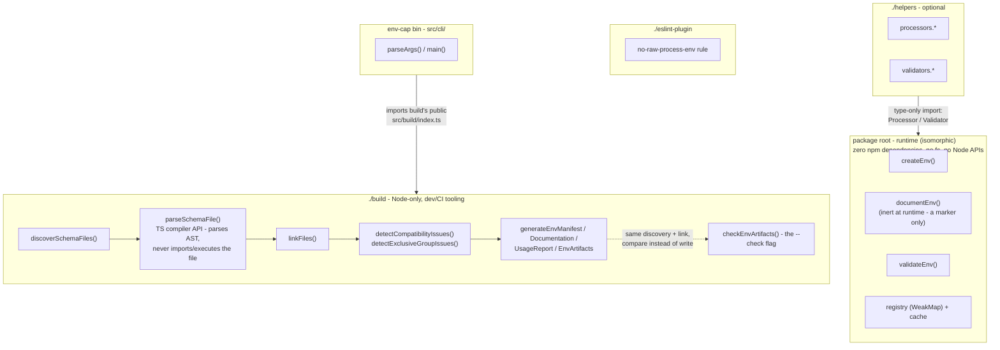
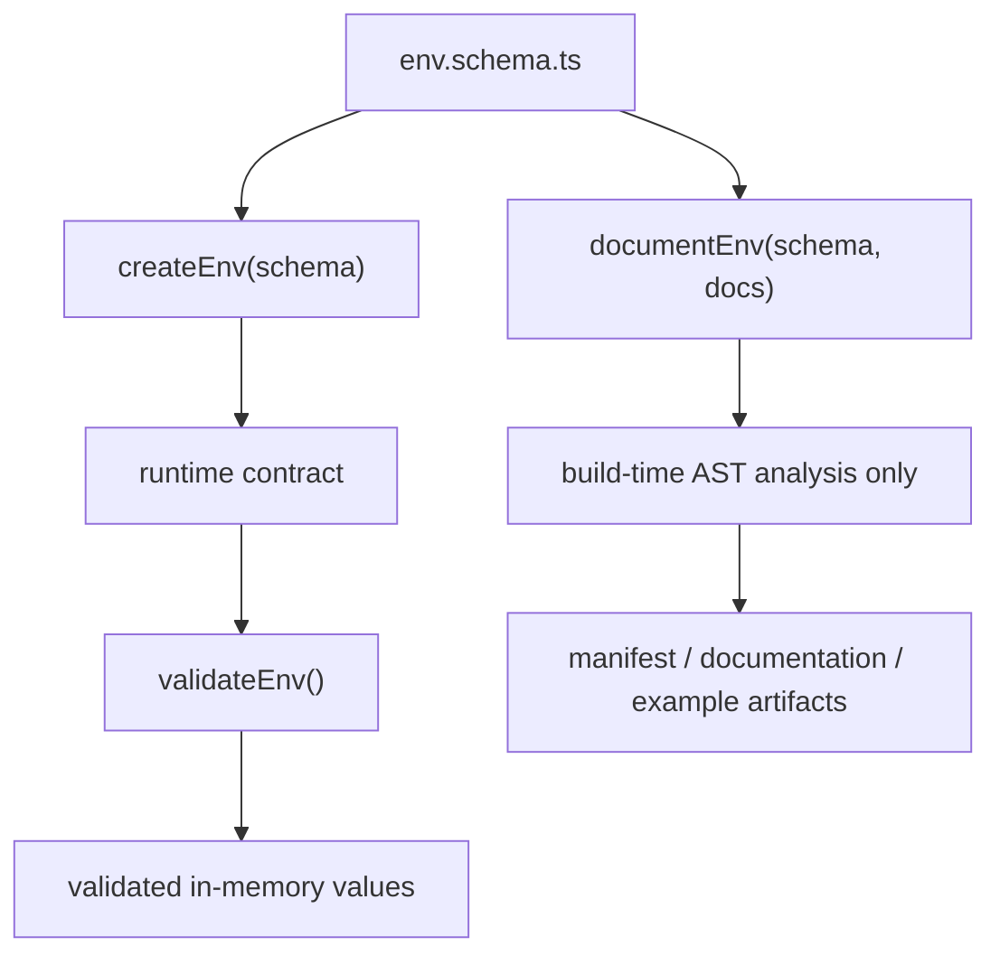
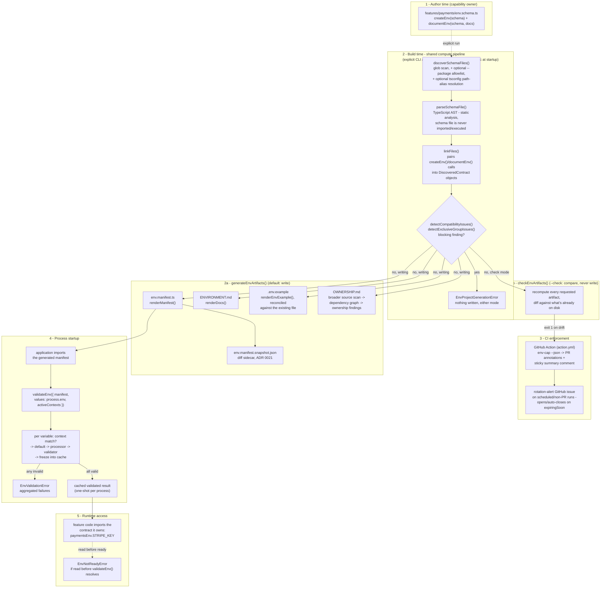
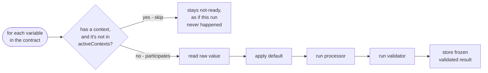

# Architecture

This document describes the structural boundaries within `env-cap`: what
each subsystem owns, what it intentionally does not own, and which
dependencies are allowed between them.

For the reasoning behind these boundaries, including rejected alternatives,
see [`decisions/`](decisions/). This document describes the current
architecture; the ADRs explain why it was designed this way.

## The four entry points

```

src/
├── runtime/        @maverickcer/env-cap                 (runtime library)
├── build/          @maverickcer/env-cap/build             (Node-only build tooling)
├── helpers/        @maverickcer/env-cap/helpers           (optional utilities)
└── eslint-plugin/  @maverickcer/env-cap/eslint-plugin      (capability-owned-access lint rule)

```

Each directory corresponds to a separate package export with its own build
output (configured in `tsup.config.ts`). Importing one entry point does not
include the implementation of the others.

`build`, `eslint-plugin`, and `runtime` contain their own implementation with
zero cross-folder dependency, including internal utilities.
`globToRegExp()`, for example, is needed by both `build/discover.ts` and
`eslint-plugin/no-raw-process-env.ts`; rather than living in a shared
internal module both would depend on, each directory owns its own copy
(`build/glob.ts`, `eslint-plugin/glob.ts` -- see ADR 0017's "Alternatives
considered"). `helpers` has exactly one cross-folder import, and it's
structural, not incidental: `processors.ts`/`validators.ts` import
`Processor`/`Validator` as types (erased at compile time) from
`runtime/index.ts`, because a helper's whole job is producing a value that
type-checks as the exact shape `createEnv()` expects -- that contract can't
be expressed without referencing runtime's own type. This is deliberate, not
an oversight: it's what lets any of these four directories move to its own
repository independent of the others, with `helpers` simply gaining
`@maverickcer/env-cap` as an ordinary dependency the way any package
depending on another package's published types would.

`src/cli/` (the `env-cap` bin, not a `package.json#exports` subpath) has the
same kind of real, intentional dependency on `build` -- it imports
`@maverickcer/env-cap/build`'s public surface (`src/build/index.ts`)
directly, never an internal `build/*.ts` file, since generating artifacts
from the command line requires the same engine `./build` exports. A
split-out `cli` package would simply declare `@maverickcer/env-cap-build` as
a normal npm dependency.

This separation is enforced through automated checks. The tree-shaking tests
and bundle-size checks fail if runtime consumers accidentally receive build
tooling or unrelated helper code.



`build`, `eslint-plugin`, and `runtime` have no edges between them above
because none exist: each owns its own copy of shared internals (e.g.
`glob.ts`) rather than importing from another entry point. `helpers`' single
edge is type-only and erased at compile time. This is what the tree-shaking
and bundle-size tests in the previous paragraph actually verify.

## `runtime/` — define, validate, cache, and expose environment values

The runtime package contains only the functionality required while an
application is running.

Its core concepts are limited to:

- `default`
- `processor`
- `validator`
- `context` (a variable's validation context, see below and ADR 0022)

These are the only pieces of information required to transform raw
environment values into validated application configuration.

`createEnv()` (`runtime/create.ts`) creates a feature-owned environment
contract. `validateEnv()` (`runtime/validate.ts`) executes every registered
contract's processing pipeline against the provided environment values and
caches successful results through `runtime/cache.ts`. Before running that
pipeline for a given variable, it first checks whether the variable's
`context` (if any) is in the run's `activeContexts` -- a variable that
doesn't match is skipped entirely (no default/processor/validator runs) and
stays in its not-ready state, exactly as if this run had never happened for
it.

### Validation context invariants

A **validation context** is an application-defined string a variable may
declare (`context`) and a validation run may activate (`activeContexts`).
env-cap never interprets, detects, or infers these strings itself -- the
application always computes and passes `activeContexts` explicitly. The
following invariants are load-bearing; none should be relaxed without a new
ADR (see [ADR 0022](decisions/0022-validation-contexts.md)):

1. **Matching.** A variable without a `context` participates in every
   validation run. A variable with a `context` participates only when
   `activeContexts` contains that exact string. No prefix matching, no
   wildcards, no hierarchy, no inheritance.
2. **Not runtime detection.** env-cap never infers, detects, or defaults
   `activeContexts` from any ambient signal (`window`, `NODE_ENV`, a
   bundler `define`, etc.). The application always computes and passes it
   explicitly.
3. **Not cache identity.** `validateEnv()` stays one-shot per process: a
   second call while already `"ready"` returns the first call's result
   outright, without inspecting the second call's `activeContexts`. There
   is no per-context cache dimension.
4. **Not a type-level concept.** Validation contexts affect participation
   at `validateEnv()` time only -- they do not alter `EnvContract`'s
   TypeScript shape, `InferEnvValue`, or any generated type. Every schema
   key remains a property of `EnvContract<S>` regardless of `context`; an
   out-of-context key throws `EnvNotReadyError` at access time, exactly
   like any value read before `validateEnv()` has run.
5. **Not authorization.** Validation contexts are not an authentication,
   authorization, or access-control mechanism. They determine validation
   participation only, never who may read a resolved value.
6. **Not a bundling/security boundary.** Separate discovery/manifests (ADR 0004) remain the real mechanism for keeping server-only source out of
   client-bound code. `activeContexts` filtering happens after the schema
   is already wherever it's going to be -- it does not remove a variable's
   definition (or its `default` value) from a bundle that imports it.

`runtime/registry.ts` maintains the internal relationship between created
contracts and their schemas using a private `WeakMap`. This keeps internal
implementation details inaccessible to application code while allowing the
runtime to resolve values safely.

`runtime/errors.ts` defines the runtime error types used for validation
failures and invalid access states.

The runtime package intentionally:

- does not access the filesystem
- does not parse source code
- does not depend on Node-specific APIs
- has zero runtime npm dependencies

This keeps the runtime small, portable, and safe to include in browser,
edge, serverless, and Node environments.

## `build/` — discover, analyze, link, and generate artifacts

The build package contains developer tooling only. It exists to analyze a
project's environment schemas and generate artifacts; it is not part of an
application's runtime execution path.

The build pipeline is responsible for:

- discovering schema files (`build/discover.ts`)
- parsing TypeScript source into AST representations (`build/parse.ts`)
- evaluating safe literal expressions (`build/literal-eval.ts`)
- linking `createEnv()` and `documentEnv()` calls (`build/link.ts`)
- detecting compatibility concerns (`build/compatibility.ts`,
  `build/exclusive-group.ts`)
- scanning source files for variable access and deriving ownership findings
  (`build/scan-dependencies.ts`, `build/dependency-graph.ts`)
- resolving live expiration overrides for documentation (`build/live-expirations.ts`)
- generating output artifacts (`build/manifest.ts`, `build/docs.ts`,
  `build/env-example.ts`, `build/usage-report.ts`)

`generateEnvManifest()` (`build/generate-manifest.ts`),
`generateDocumentation()` (`build/generate-documentation.ts`), and
`generateUsageReport()` (`build/generate-usage.ts`) each coordinate one of
these passes and are responsible for writing their own generated files.
`generateEnvArtifacts()` (`build/generate-env-artifacts.ts`) composes all
three into a single call sharing one discovery pass and one combined
blocking-failure check.

The build package never imports or executes application schema files. It
analyzes source structure instead of running user code. This preserves the
safety boundary required for CI environments and large monorepos.

See
[`decisions/0002-static-analysis-never-execution.md`](decisions/0002-static-analysis-never-execution.md)
for the reasoning behind AST analysis instead of dynamic imports.

## `helpers/` — optional processors and validators

The helpers package provides reusable implementations of the
`Processor` and `Validator` function types defined by
`runtime/types.ts`.

Examples include common transformations and validation patterns that most
applications would otherwise need to implement manually.

The runtime package has no dependency on helpers. They are convenience
utilities, not part of the environment-contract execution model.

`processors` and `validators` are separate exports so applications can
include only the category they use.

## Documentation is parallel to runtime, not part of runtime state

The most important architectural separation is the distinction between
runtime configuration and human-facing documentation.

`createEnv()` defines the information required to process and validate
environment values.

`documentEnv()` defines information intended for developers, operators, and
generated artifacts, such as:

- descriptions
- ownership information
- lifecycle details
- expiration dates
- operational guidance

`documentEnv()` is intentionally inert at runtime. It exists as a source-level
marker that the build system can discover through AST analysis. It does not
store documentation data in memory or add documentation fields to runtime
contracts.

The relationship is therefore not a runtime pipeline:



The same schema file can contain both calls, but they serve different
consumers:

- application runtime consumes `createEnv()`
- build tooling consumes `documentEnv()`

## Data flow



`generateEnvArtifacts()` and `checkEnvArtifacts()` share one
`computeArtifacts()` pass (discovery, parsing, linking, and blocking-finding
checks) and only diverge at the last step: write, or compare-and-report (see
[ADR 0011](decisions/0011-shared-discovery-compute-atomic-write-non-atomic.md)
and [ADR 0016](decisions/0016-check-mode-compute-before-compare-never-partial-write.md)).
Manifest, docs, `.env.example`, and the ownership report are each optional
per invocation (`--location`/`--docs`/`--ownership`) and only appear above
when requested. The GitHub Action wraps whichever mode a workflow invokes
`env-cap --json` with.

### 1. Author time

A feature owner creates an environment schema:

```

features/payments/env.schema.ts

```

The file defines:

- the feature's environment variables
- processing rules
- validation rules
- optional documentation metadata

Importing the file creates the contract object but does not resolve
environment values.

### 2. Build time

`generateEnvManifest()` runs as an explicit development or CI step.

It:

1. discovers schema files
2. parses their ASTs
3. links `createEnv()` and `documentEnv()` calls
4. checks for detectable issues
5. generates requested artifacts

Possible outputs include:

- environment manifests
- documentation artifacts
- `.env.example` files

This process never runs automatically during application startup.

### 3. Process startup

The application imports the generated manifest and calls:

```ts
validateEnv({ manifest, values: process.env })
```

Validation happens once for the process lifetime.

Each contract, per variable:

1. checks whether the variable's `context` matches this run's
   `activeContexts` -- if not, skips every remaining step entirely and
   moves to the next variable (see "Validation context invariants" above)
2. reads its raw value
3. applies its default
4. runs its processor
5. runs its validator
6. stores the frozen validated result



Failures are aggregated into `EnvValidationError` rather than stopping at
the first invalid variable.

### 4. Runtime access

Feature code imports the contract it owns:

```ts
paymentsEnv.STRIPE_KEY
```

There is no global environment object.

Accessing a value before validation completes throws `EnvNotReadyError`.
Successful access returns the validated value for that specific feature
contract.

## Architectural decisions

| Boundary                                                                                                               | ADR                                                                             |
| ---------------------------------------------------------------------------------------------------------------------- | ------------------------------------------------------------------------------- |
| One `createEnv` vs `createEnv` + `defineEnv`                                                                           | [0001](decisions/0001-runtime-documentation-separation.md)                      |
| Parsing instead of importing schema files                                                                              | [0002](decisions/0002-static-analysis-never-execution.md)                       |
| Per-feature contracts instead of global `env`                                                                          | [0003](decisions/0003-no-global-env-object.md)                                  |
| No `/client` or `/server` package split                                                                                | [0004](decisions/0004-no-client-server-package-split.md)                        |
| Warn by default instead of throwing                                                                                    | [0005](decisions/0005-warn-not-throw-by-default.md)                             |
| Self-redacting contracts                                                                                               | [0006](decisions/0006-self-redacting-contracts.md)                              |
| `processor` terminology instead of `transformer`                                                                       | [0007](decisions/0007-processor-not-transformer.md)                             |
| Fixed gzip size budget on runtime/helpers                                                                              | [0008](decisions/0008-gzip-size-budget.md)                                      |
| Exclusive-group violations always error                                                                                | [0009](decisions/0009-exclusive-groups-are-always-errors.md)                    |
| Dependency-ownership engine's fixed scope, internals not public                                                        | [0010](decisions/0010-dependency-ownership-engine-scope-boundary.md)            |
| Shared discovery, compute-atomic but not write-atomic `generateEnvArtifacts()`                                         | [0011](decisions/0011-shared-discovery-compute-atomic-write-non-atomic.md)      |
| Live expiration overrides via callback, not AST                                                                        | [0012](decisions/0012-live-expiration-overrides-not-ast-functions.md)           |
| `--json` CLI output is a versioned mirror                                                                              | [0013](decisions/0013-json-output-is-a-versioned-mirror.md)                     |
| Cross-package schema discovery via explicit allowlist (Experimental)                                                   | [0014](decisions/0014-cross-package-schema-discovery.md)                        |
| Post-1.0 security-fix backport window (one major back, ≥6 months, never shortened once stated)                         | [0015](decisions/0015-security-backport-window.md)                              |
| `--check` computes fully before comparing, and never partially writes                                                  | [0016](decisions/0016-check-mode-compute-before-compare-never-partial-write.md) |
| A 4th public entry point (`./eslint-plugin`) for a capability-owned-access lint rule                                   | [0017](decisions/0017-eslint-plugin-entry-point.md)                             |
| Rotation-alert GitHub issue on non-PR Action runs (opens/auto-closes based on expiringSoon)                            | [0018](decisions/0018-rotation-alert-issue-on-non-pr-runs.md)                   |
| The published `--json` schema is generated from types, never hand-authored                                             | [0019](decisions/0019-published-json-schema-generated-from-types.md)            |
| Declaration maps emitted by a separate `tsc` pass, not tsup's own `dts` pipeline                                       | [0020](decisions/0020-declaration-maps-via-separate-tsc-pass.md)                |
| The manifest change report is a persisted, committed JSON sidecar snapshot                                             | [0021](decisions/0021-manifest-change-report-persisted-snapshot.md)             |
| Generic, declarative validation contexts (`context`/`activeContexts`)                                                  | [0022](decisions/0022-validation-contexts.md)                                   |
| TypeScript path-alias resolution, on by default (Experimental)                                                         | [0023](decisions/0023-tsconfig-path-alias-resolution.md)                        |
| Seven canonical fact models (Contract/Dependency/Ownership/Lifecycle/Finding/Change/Evidence), not thirty-five reports | [0024](decisions/0024-fact-model-architecture.md)                               |
| Contract Model is a new, versioned JSON projection, published alongside the manifest                                   | [0025](decisions/0025-contract-model-json-projection.md)                        |
| Finding Model unifies four independently-shaped finding families                                                       | [0026](decisions/0026-finding-model-unifies-four-families.md)                   |
| Dependency Model publishes a fact-shaped result, not the scanning engine                                               | [0027](decisions/0027-dependency-model-fact-shape-not-engine-access.md)         |
| Ownership Model shares one effectiveOwner() rule, fixing a pre-existing divergence                                     | [0028](decisions/0028-ownership-model-shared-effective-owner.md)                |
| Lifecycle Model adds deprecation/rename fields, promotes ExpiringEntry                                                 | [0029](decisions/0029-lifecycle-model-deprecation-rename-fields.md)             |
